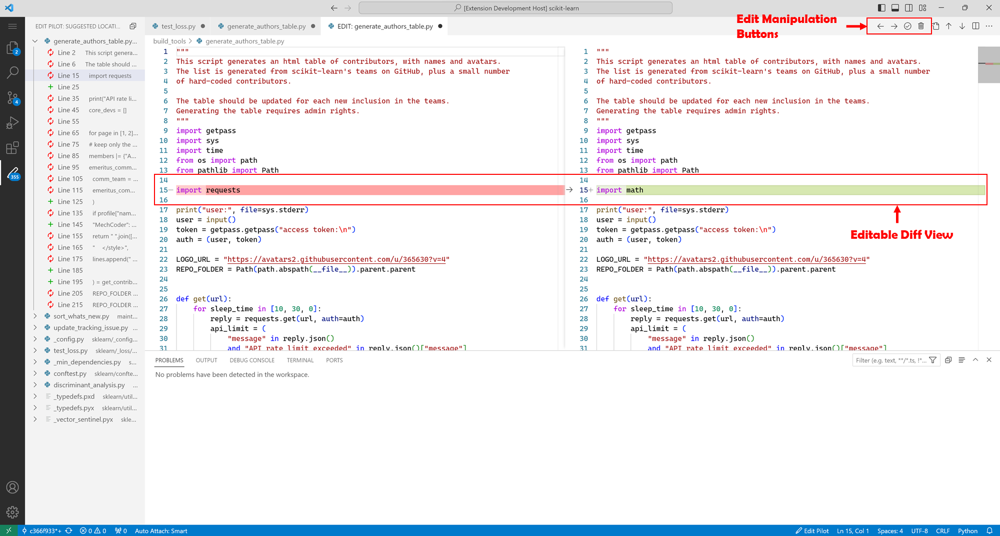

# ✏️ Edit Pilot

Edit Pilot is a Visual Studio Code extension that features automatic code edit recommendations.

## ⚙️ Functionality

The extension introduces two major features: **Edit Locator** and **Edit Generator.** 

### Edit Locator

Combining a **🔍 discriminator model** and a **🎯 locator model.** It suggests edit locations according to *previous edits* and *current edit description.*

### Edit Generator

Based on a single **📝 generator model.** It generates replacements or additions somewhere in the code, from suggested locations or manually selected. It also requires *previous edits* and *current edit description* and, in addition, the code to replace.

## ✨ UI

### Overview


+ Predicted locations will be displayed as a tree view in the left ⬅️ and also highlighted in the active editor
+ Query status will be displayed in the status bar ↘️
+ Edit description is accepted in the input above ⬆️

### Diff View



Once performing a prediction on a line, a diff view is shown for switching ↔️ or editing ✏️ the prediction result.

## 🧑‍💻Usage

1. Edit the code, as our extension will automatically record most previous edits.

2. Run `Predict Locations`: **right-click** anywhere in the editor and select it in the menu, or use the default keybinding `Ctrl + Alt + L` (in MacOS `Cmd + Alt + L`)

3. Run `Generate Edits`: select the code to be edited in the editor, then **right-click** and select it in the menu, or use the default keybinding `Ctrl + Alt + E` (in MacOS `Cmd + Alt + E`)

> [!NOTE]
> Select part of the code for **replacing** (or select nothing for **adding**). And by default accepting an edit will trigger another location prediction immediately (you can change this in extension configuration).

4. Manually `Change Edit Description`: **right-click** and select it in the menu. By default the input box will automatically show at query **whenever the edit description is empty.**


4. After the model generates possible edits at that range, a difference tab with pop up for you to switch to different edits or edit the code. **There are buttons on the top right corner of the difference tab to accept, dismiss or switch among generated edits.**


## 🏗️ Backend Deployment

### Run backend models

Our model scripts require **Python 3.10** and **Pytorch with CUDA.**  

#### Step 1: Install Python dependencies

> [!IMPORTANT]
> For *Windows* and *Linux using CUDA 11.8,* please follow [PyTorch official guide](https://pytorch.org/get-started/locally/) to install PyTorch with CUDA before the following steps.

Using `pip` :

```shell
pip install -r requirements.txt
```

Or using `conda` :

```shell
conda create -n code-edit
conda activate code-edit
conda install python=3.10.13
python -m pip install -r requirements.txt
```

#### Step 2: Download models into the project directory

As mentioned before, we respectively prepared 3 models (*discriminator*, *locator*, and *generator*) for each language. Supported languages are `go`, `python`, `java`, `typescript` and `javascript`.

Download **models for different languages** from [here](https://drive.google.com/file/d/1nW1NCeelOUZfqebrncKvlB7FVZutjQsT/view?usp=sharing). To deploy for one language, put its unzipped model folder **named with the language** (e.g. for Python we put `python`) into the project root directory.

#### Step 3: Start the backend

Simply run `server.py` from the project root directory

```shell
python src/model_server/server.py
```

> [!NOTE]
> Always remember to start up backend models which the extension must base on.

## 🕹️ Run Extension

This extension is currently not released in VS Code Extension Store. Follow the next steps to run the extension in development mode in VS Code.

#### Step 1: Install Node.js

See [Node.js official website](https://nodejs.org/en/download).

#### Step 2: Install Node dependencies

In the project root directory, install Node packages

```shell
npm install
```

#### Step 3: Run extension using VS Code development host

Open the project directory in VS Code if didn't, press `F5`, then choose `Run Extension` if you are required to choose a configuration. Note that other extensions will be disabled in the development host.

## 🛠️ Advanced Deployment

We recommend to try this extension with backend deployed locally. This will require **CUDA** and **~4GB** video memory. But deploying backend remotely is also easy, since key is to match extension configuration of VS Code and the server listening configuration. 

By default `server.py` uses `server.ini` as configuration and listens to `0.0.0.0:5001`. The extension client sends requests to `editPilot.queryUrl`, by default `http://localhost:5001`.

For basic remote backend deployment:

+ On the backend machine, confirm the IP on LAN/WAN, and open up a port through firewall.
+ Use that port in `server.ini` then run the backend `server.py`.
+ When using the extension, set `editPilot.queryUrl` in VS Code settings (press `Ctrl + ,` then search) to the proper connectable IP of the server.

## ❓ Issues

The project is still in development, not fully tested on different platforms. 

Welcome to propose issues or contribute to the code.

**😄 Enjoy coding!**
